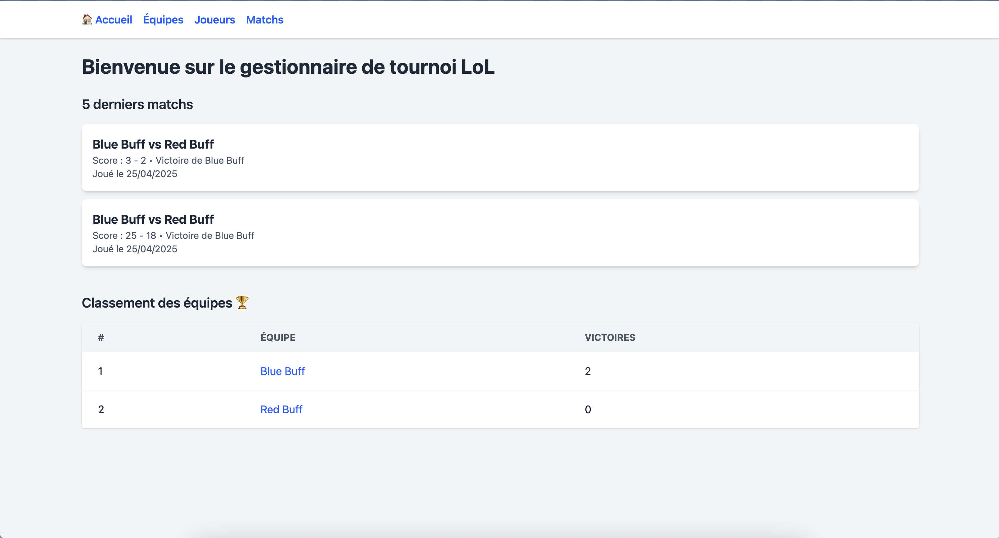
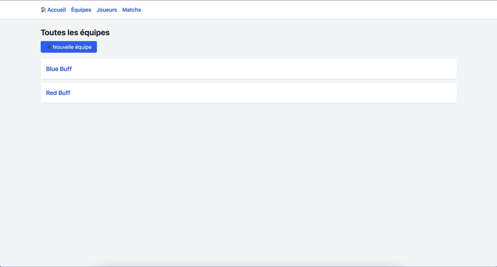
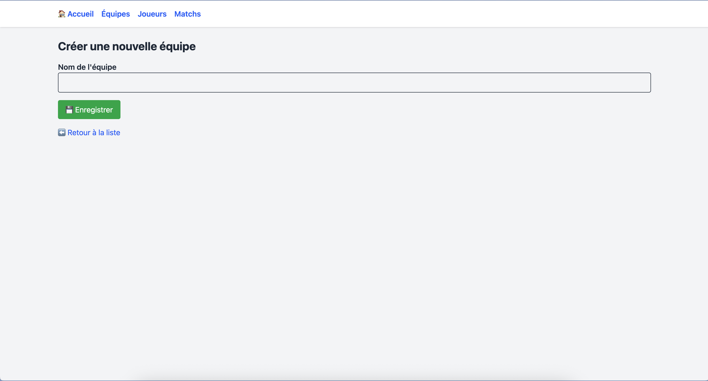
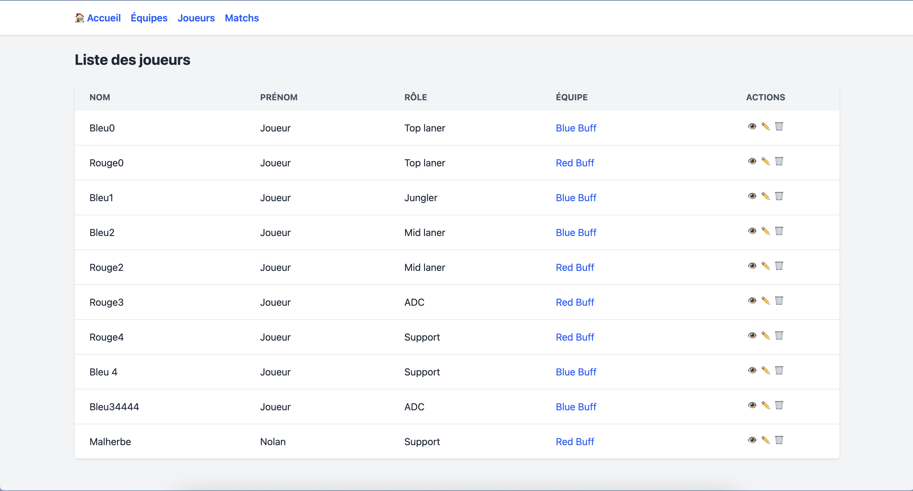
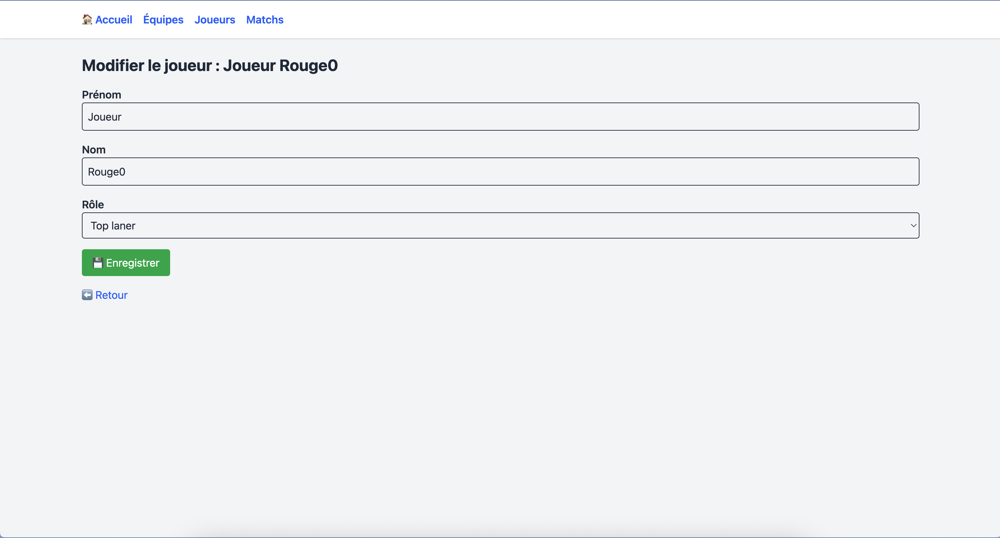
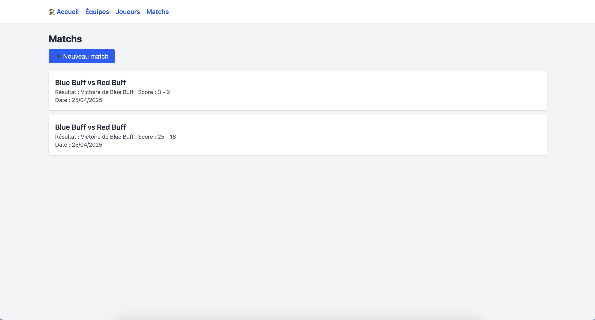
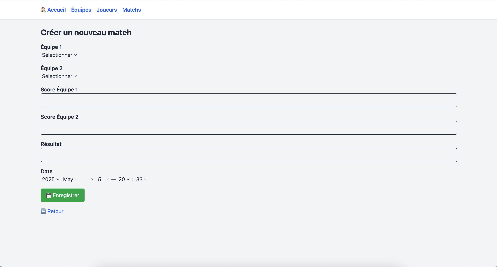
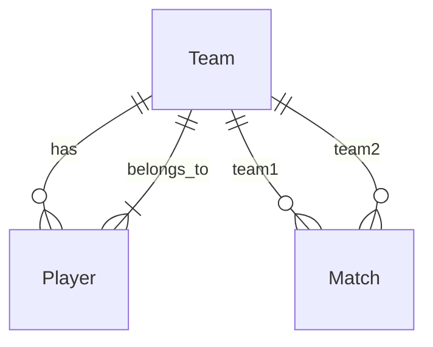

# Documentation de l'Application LoL Tournament Manager

## Table des matières

1. [Introduction](#introduction)
2. [Architecture](#architecture)
3. [Fonctionnalités détaillées](#fonctionnalités-détaillées)
4. [Interface utilisateur](#interface-utilisateur)
5. [Base de données](#base-de-données)
6. [Configuration et déploiement](#configuration-et-déploiement)

## Introduction

LoL Tournament Manager est une application web développée en Ruby on Rails permettant de gérer des tournois de League of Legends. Elle offre une interface intuitive pour la gestion des équipes, des joueurs et des matchs, avec un système de classement automatique.

### Objectifs

- Simplifier la gestion des tournois de League of Legends
- Fournir une interface utilisateur intuitive et responsive
- Automatiser le calcul des classements
- Permettre un suivi en temps réel des matchs et des équipes

## Architecture

### Stack technique

- **Backend** : Ruby on Rails 8.0.2
- **Base de données** : PostgreSQL
- **Frontend** :
  - Tailwind CSS pour le style
  - Turbo/Hotwire pour l'interactivité
  - Stimulus pour le JavaScript

### Structure de l'application

L'application suit l'architecture MVC (Model-View-Controller) de Rails :

- **Models** : Team, Player, Match
- **Controllers** : TeamsController, PlayersController, MatchesController
- **Views** : Templates ERB avec Tailwind CSS

## Fonctionnalités détaillées

### Gestion des équipes

- Création d'équipes avec nom unique
- Limitation à 5 joueurs par équipe
- Visualisation des statistiques d'équipe

### Gestion des joueurs

- Ajout de joueurs avec leurs rôles spécifiques
- Attribution des joueurs aux équipes
- Gestion des rôles (Top laner, Jungler, Mid laner, ADC, Support)

### Gestion des matchs

- Création de matchs entre équipes
- Enregistrement des scores
- Validation des équipes (minimum 1 joueur par équipe)
- Historique des matchs

### Classement

- Calcul automatique des victoires
- Classement dynamique mis à jour en temps réel
- Affichage des 5 derniers matchs sur la page d'accueil

## Interface utilisateur

### Pages principales

#### Page d'accueil

La page d'accueil présente un aperçu général du tournoi avec :

- Les 5 derniers matchs joués
- Un résumé des statistiques principales
- Un accès rapide aux différentes sections

#### Gestion des équipes

La page des équipes permet de :

- Voir la liste complète des équipes
- Accéder aux détails de chaque équipe
- Voir les statistiques de chaque équipe

Le formulaire de création d'équipe permet de :

- Définir le nom de l'équipe
- Ajouter des joueurs à l'équipe
- Gérer la composition de l'équipe

#### Gestion des joueurs

La page des joueurs affiche :

- La liste complète des joueurs
- Leur équipe respective
- Leur rôle dans l'équipe

Le formulaire de modification permet de :

- Modifier les informations personnelles
- Changer le rôle du joueur
- Transférer le joueur vers une autre équipe

#### Gestion des matchs

La page des matchs présente :

- L'historique complet des matchs
- Les scores de chaque match
- Les équipes participantes

Le formulaire de création de match permet de :

- Sélectionner les équipes participantes
- Définir les scores
- Enregistrer la date du match

### Navigation

- Menu principal accessible sur toutes les pages
- Navigation intuitive entre les différentes sections
- Design responsive adapté à tous les écrans

## Base de données

### Schéma

### Tables principales

1. **teams**

   - id
   - name (unique)
   - created_at
   - updated_at

2. **players**

   - id
   - first_name
   - last_name
   - role
   - team_id
   - created_at
   - updated_at

3. **matches**
   - id
   - team1_id
   - team2_id
   - score_team1
   - score_team2
   - date
   - created_at
   - updated_at

## Configuration et déploiement

### Prérequis

- Ruby 3.x
- Rails 8.0.2
- PostgreSQL
- Node.js (pour Tailwind CSS)

### Installation

1. Cloner le dépôt
2. Installer les dépendances Ruby (`bundle install`)
3. Configurer la base de données
4. Lancer le serveur de développement

### Variables d'environnement

- `DATABASE_URL` : URL de connexion à PostgreSQL
- `RAILS_ENV` : Environnement d'exécution

## Contribution

### Guidelines

- Suivre les conventions Ruby
- Utiliser Rubocop pour le linting
- Écrire des tests pour les nouvelles fonctionnalités

### Processus de développement

1. Créer une branche pour la nouvelle fonctionnalité
2. Développer et tester localement
3. Soumettre une pull request
4. Revue de code
5. Merge après approbation
